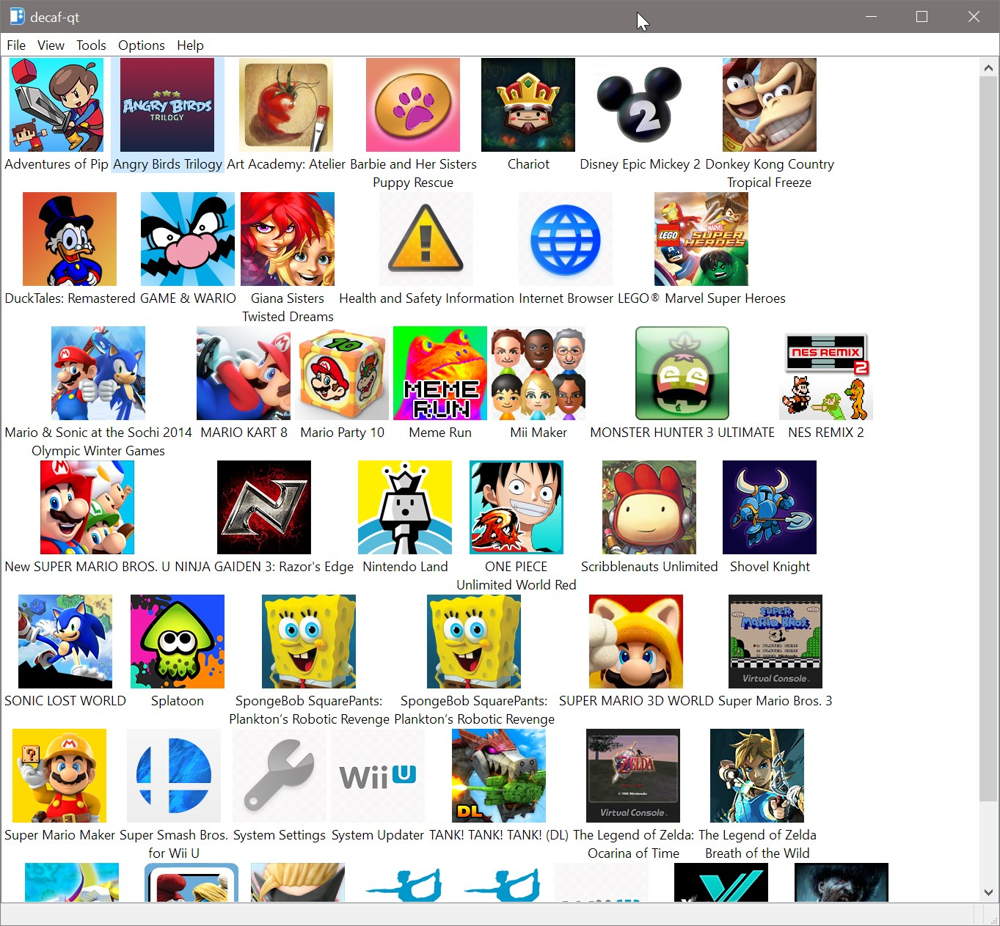
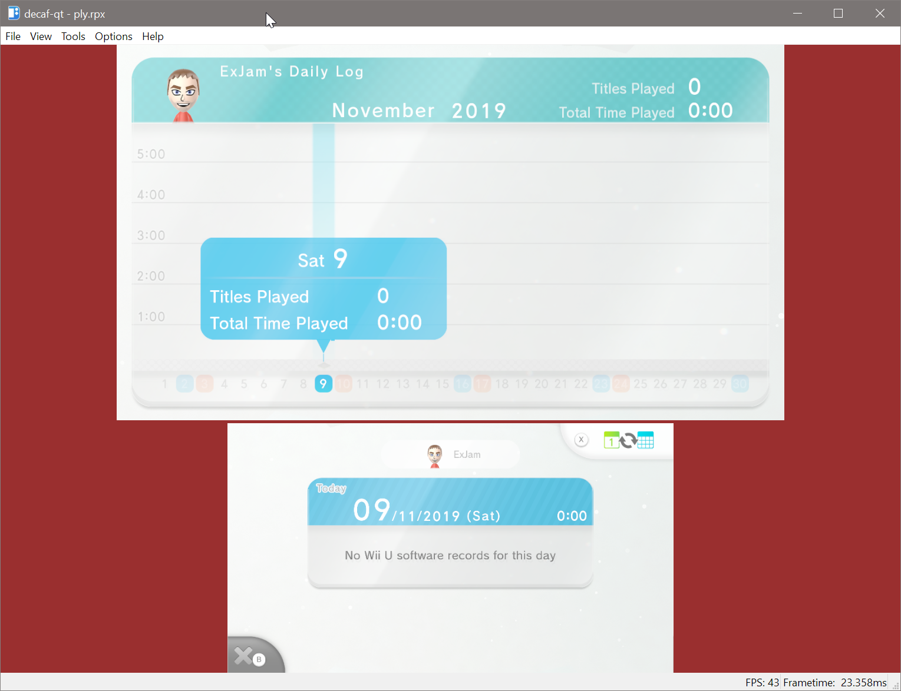
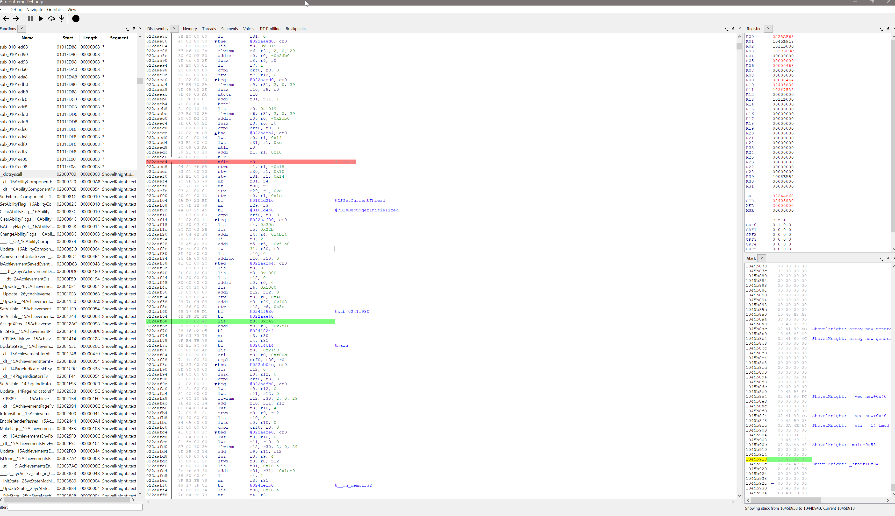

# decaf-emu
This is a project about researching and documenting the Wii U hardware with the goal of creating a functional emulator for the system. Licensed under the terms of the GNU General Public License, version 3 or later (GPLv3+).

You can find us for developer discussion:
- on discord using https://discord.gg/tPqFBnr
- or at #wiiu-emu on freenode.

## Screenshots

## Requirements
* Operating System
    * Windows with the Visual Studio 2019 toolchain
    * Linux with a modern C++ 17 friendly compiler
* Hardware
    * A modern x86-64 processor
    * A graphics card with support for the Vulkan API
* Software
    * CMake v3.2+
    * Vulkan SDK 1.1.92.1+

## Support
- None, this is an in-development project and user support is not provided.

## Binaries
The latest Windows binaries are available via [Actions artifacts](https://github.com/decaf-emu/decaf-emu/actions). For Linux a manual build is required.

## Running

It is recommended you use the GUI interface of the emulator by running the decaf-qt executable. However the emulator can also be launched from the command line by running:

`./decaf-sdl play <path to game>`

It is recommended to run the emulator from the root git directory so that it is able to access `resources/fonts/*`.  Alternatively, set `resources_path` in the configuration file to point to the resources directory.

Configuration files can be found at:
- Windows - `%APPDATA%\decaf`
- Linux - `~/.config/decaf`

On Linux, a "Bus error" crash usually indicates an out-of-space error in the temporary directory.  Set the `TMPDIR` environment variable to a directory on a filesystem with at least 2GB free.

## Building from Source

See [BUILDING.md](BUILDING.md)
